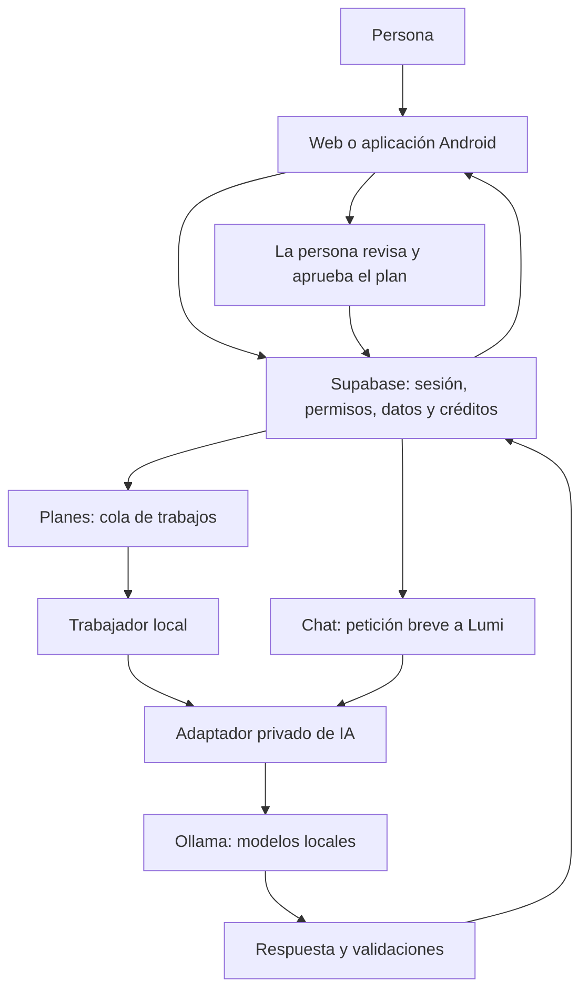

# PlanifIA: explicación y guía para continuar el trabajo

Esta guía está escrita para una persona o una IA que llegue al proyecto sin conocer la conversación. Fecha de trabajo: 9 de octubre de 2026, horario de Chile. Los archivos de resultados usan UTC y pueden indicar 10 de octubre.

## Qué hace el producto

PlanifIA ayuda a convertir metas en pasos pequeños, distribuirlos en un calendario y registrar el progreso. Lumi es la mascota virtual que acompaña a la persona. La aplicación tiene dos usos diferentes de inteligencia artificial: conversar con Lumi y proponer un plan. Los créditos que cobra la aplicación son una unidad del producto; no representan una factura por tokens de un proveedor.

La web se publica en https://planifia.cl/. La aplicación Android reutiliza la misma interfaz mediante Tauri. Supabase guarda cuentas, metas, tareas, conversaciones y créditos. La IA se ejecuta con Ollama en el equipo del operador. Si ese equipo o su conexión no están disponibles, la aplicación no dispone de la misma capacidad de respuesta de IA. La aplicación incluye estados de error, cola y devolución de créditos para esos casos, con las limitaciones descritas en la auditoría.

## Cómo se mueve la información

El servidor decide qué datos puede ver cada persona y qué operaciones están permitidas. La interfaz no es una barrera de seguridad: ocultar un botón no impide que alguien intente enviar la petición directamente. Por eso permisos, saldo, cuotas y validación deben seguir aplicándose en el servidor.

La IA propone texto y planes. No tiene herramientas para comprar créditos, ejecutar consultas de base de datos ni borrar metas. Un plan generado no se guarda automáticamente como una meta: requiere revisión y aprobación. Los cálculos de minutos, fechas y capacidad se hacen y comprueban con código.

## Qué se corrigió y por qué

| Cambio | Explicación sin tecnicismos | Dónde está |
|---|---|---|
| Recompensas de anuncios | Antes podían mezclarse datos firmados con un usuario agregado fuera de la firma. Ahora sólo se aceptan los datos que la firma protege y se rechazan parámetros ambiguos. La reproducción no demuestra que haya ocurrido fraude. | `supabase/functions/admob-ssv/handler.ts` |
| Reintentos de planes | Si dos propuestas incumplen las reglas, no se inicia otra tanda idéntica desde la cola. Los problemas temporales de conexión conservan sus reintentos limitados. | `_shared/generate-plan.ts`, `scripts/ai-worker.js` |
| Calendarios grandes | Se leen todas las páginas necesarias, evitando calcular disponibilidad con un calendario incompleto. Si no puede verificarse la lectura completa, se detiene la generación. | `_shared/plan-context.ts`, `goal-plan/handler.ts` |
| Contexto útil | Se conservan el contenido de las metas y las acciones realizadas; se omiten identificadores y datos técnicos que no ayudan al modelo. | `_shared/plan-context.ts` |
| Instrucciones y datos | Los nombres y las metas editables ya no se envían como instrucciones de máxima autoridad. Eso reduce una vía de manipulación, pero no garantiza inmunidad a todos los ataques. | `lumi-chat/handler.ts` |
| Peticiones demasiado grandes | Se detiene la lectura al superar el tamaño permitido, en lugar de cargar todo primero en memoria. | `_shared/request-body.ts` |
| Errores y créditos | La aplicación sólo afirma una devolución cuando puede confirmarla. Si pierde la conexión, explica la incertidumbre. | `lumi-chat/handler.ts`, `src/lumi-chat.js` |
| Operaciones del chat | Cargar, enviar y borrar no pueden competir dentro de la misma vista. | `src/lumi-chat.js` |
| Legibilidad y navegación | Se mejoró el contraste del texto secundario, el salto de teclado al contenido y los enlaces legales. | `src/style.css`, `src/main.js` |
| Calidad lingüística | Las instrucciones del chat aclaran cómo seguir un cambio de meta, reconocer información ausente y evitar teléfonos inventados. Se descartó un cambio experimental del prompt de planes porque introducía nuevas incoherencias. | `lumi-chat/handler.ts`; ensayo documentado en la evaluación |

## Qué significa «más económico» en este proyecto

Un modelo pequeño puede usar menos memoria, pero eso no prueba que responda mejor ni que reduzca la factura. Puede equivocarse más, necesitar correcciones, tardar más en este hardware o desplazar otro modelo de memoria.

La comparación mide por separado tiempo, tokens, memoria y calidad. No se han medido consumo eléctrico, tarifa eléctrica ni amortización del equipo. Por ello no se calcula un ahorro en pesos ni un porcentaje de ahorro global. Eliminar llamadas innecesarias sí evita trabajo; cuánto representa al mes depende de cuántas veces ocurra ese fallo en producción.

Los resultados, decisiones y límites de la muestra están en [la evaluación de modelos](modelos-2026-10-09.md). El [protocolo ampliado](evaluacion-ia.md) contiene los casos que aún deben cubrirse antes de una sustitución general. Un indicador automático de «formato válido» no evalúa que una respuesta sea verdadera, coherente o útil.

## Mapa para otra persona o IA

| Necesidad | Archivo o carpeta |
|---|---|
| Entender pantallas y navegación | `src/main.js`, `src/style.css` |
| Entender chat y estados de espera | `src/lumi-chat.js`, `supabase/functions/lumi-chat/` |
| Entender permisos y créditos | `supabase/migrations/` |
| Entender creación de planes | `supabase/functions/goal-plan/`, `supabase/functions/_shared/plan.js` |
| Entender reintentos y generación | `scripts/ai-worker.js`, `_shared/generate-plan.ts` |
| Entender conexión a modelos locales | `scripts/ollama-gateway.js`, `.env.gateway.example` |
| Repetir comparación sintética de modelos | `scripts/evaluate-models.ts` |
| Verificar despliegue con cuentas temporales | `scripts/verify-release.mjs` — requiere activación explícita |
| Revisar evidencia, impactos y pendientes | `docs/auditoria-2026-10-09.md` |

Los archivos `.env.local` y `.env.gateway.local` contienen configuración privada. No copiarlos a una conversación, informe, captura o commit. Usar los ejemplos sin secretos para explicar la configuración. Las claves administrativas nunca deben llegar al navegador.

Antes de editar, revisar el estado de Git. Se preservaron cambios ajenos en Android, `.claude/` y una presentación de PowerPoint; no deben descartarse ni incluirse accidentalmente en un commit. No usar `git add .` ni restaurar todo el directorio para limpiar la auditoría.

## Cómo comprobar y continuar

1. Ejecutar las pruebas proporcionales al cambio: `npm test`, `npm run test:edge`, `npm run check:edge` y `npm run build`. Para cambios de interfaz, ejecutar las suites de navegador correspondientes y revisar capturas reales.
2. Para evaluar modelos, usar datos ficticios, los mismos casos y parámetros, y conservar resultados fallidos. El evaluador es opcional: produce inferencia real en la GPU local y no debe ejecutarse durante carga importante de usuarios.
3. Revisar contenido además de cifras: la meta elegida debe mantenerse, no deben inventarse hechos y las tareas deben ayudar a conseguir un resultado realista. Mantener la aprobación humana de planes.
4. Publicar por el proceso existente. La web usa GitHub Pages desde `main`; las funciones del servidor se publican por separado; el trabajador necesita reinicio para leer cambios de código. Publicar Git no actualiza automáticamente todos esos componentes.
5. Verificar la web publicada y los recorridos de chat y plan. El verificador real crea sus propias cuentas, revisa aislamiento y cobro único, y elimina únicamente esas cuentas al terminar. No ejecuta compras ni anuncios reales.

Quedan pendientes la validación de pagos/anuncios reales, entrega de correos, revisión completa de dependencias Android/Rust, concurrencia entre dispositivos al borrar el chat, devolución de mensajes interrumpidos sin que el usuario vuelva a escribir, métricas de producción y pruebas de accesibilidad con lectores de pantalla. La configuración remota informó protección contra contraseñas filtradas desactivada; debe revisarse su disponibilidad y costo antes de cambiar el servicio.

La copia de las funciones desplegadas antes del arreglo quedó localmente en `artifacts/deploy-backup-20261009/`. Sirve para recuperación técnica; restaurarla reintroduciría los problemas corregidos y requiere valorar el incidente concreto. La copia no sustituye respaldos de la base de datos. No hubo migración de base de datos en esta intervención.

Esta revisión identifica y corrige problemas comprobados. No certifica seguridad completa ni que un modelo siempre vaya a responder correctamente.
